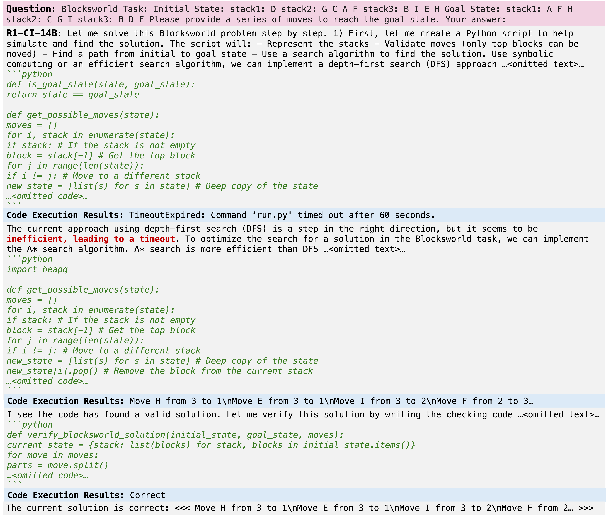
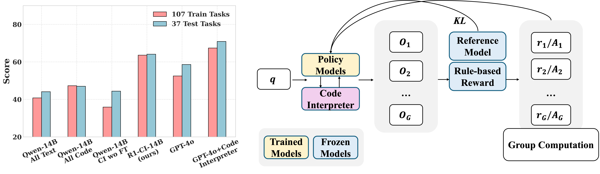
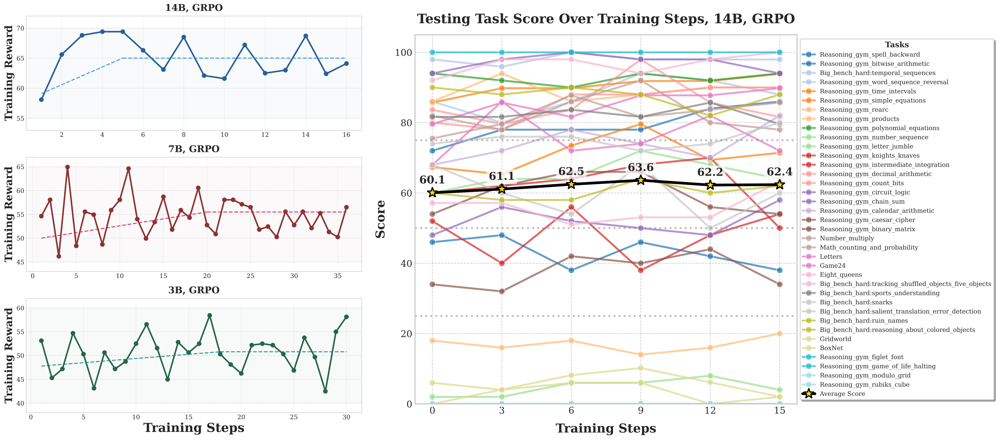

# R1-Code-Interpreter: Training LLMs to Reason with Code via Supervised and Reinforcement Learning

Our code is based on [Llama-factory](https://github.com/hiyouga/LLaMA-Factory), [VeRL](https://github.com/volcengine/verl), and [Search-R1](https://github.com/PeterGriffinJin/Search-R1?tab=readme-ov-file) for the SFT and RL training and inference.

## 📝 Introduction
R1-Code-Interpreter is the first framework to train LLMs for step-by-step code reasoning using multi-turn supervised fine-tuning and reinforcement learning. By curating 144 diverse reasoning and planning tasks, we enable Qwen-2.5 models (3B/7B/14B) to autonomously decide when and how to invoke code. Our best model, R1-CI-14B, outperforms GPT-4o (text-only) and approaches GPT-4o with Code Interpreter, showing emergent self-checking behavior via code generation.
<p align="center">
  
</p>

## 🏆 Performance
<p align="center">
  
</p>

### GRPO Training
<p align="center">
  
</p>

## 🤖 Model
R1-CI-14B/7B/3B are now available on huggingface-hub:
| Model Name | HF Checkpoint                                                | Size                                                    |
| ---------- | ------------------------------------------------------------ | :------: |
| R1-Code-Interpreter-14B     | [🤗 yongchao98/R1-Code-Interpreter-14B](https://huggingface.co/yongchao98/R1-Code-Interpreter-14B) | **14B**
| R1-Code-Interpreter-7B     | [🤗 yongchao98/R1-Code-Interpreter-7B](https://huggingface.co/yongchao98/R1-Code-Interpreter-7B) | **7B**
| R1-Code-Interpreter-3B     | [🤗 yongchao98/R1-Code-Interpreter-3B](https://huggingface.co/yongchao98/R1-Code-Interpreter-3B) | **3B**

## 🚀 Get Started

### Package Installation

To begin using this repo, you need to install the required dependencies. You can do this by running the following command:

```
git clone https://github.com/yongchao98/R1-Code-Interpreter.git
cd R1-Code-Interpreter
conda create -n R1_code_inter python=3.11
conda activate R1_code_inter
pip install reasoning-gym
git clone https://github.com/volcengine/verl.git
cd verl
pip3 install -e .
pip install --upgrade huggingface_hub
huggingface-cli login
cd ../Search-R1
pip install -r requirements.txt
pip3 install flash-attn --no-build-isolation
```

### GRPO training
(In train_grpo_3B.sh, fill your wandb key and python local path in line 1 and line 2; In r1_code_inter/generation_models.py and ../generation_models.py, fill in your OpenAI API for GPT-4o calling to extract the answer):
```
sh train_grpo_3B.sh
```

### Inference
(In train_grpo_3B.sh, fill your wandb key and python local path in line 1 and line 2; In r1_code_inter/generation_models.py and ../generation_models.py, fill in your OpenAI API for GPT-4o calling to extract the answer):
```
conda create -n llama_factory python=3.11
conda activate llama_factory
cd LLaMA-Factory
pip install -r requirements.txt
cd ..
```

## ✍️ Citation
```md
@misc{chen2025r1codeinterpretertrainingllmsreason,
      title={R1-Code-Interpreter: Training LLMs to Reason with Code via Supervised and Reinforcement Learning}, 
      author={Yongchao Chen and Yueying Liu and Junwei Zhou and Yilun Hao and Jingquan Wang and Yang Zhang and Chuchu Fan},
      year={2025},
      eprint={2505.21668},
      archivePrefix={arXiv},
      primaryClass={cs.AI},
      url={https://arxiv.org/abs/2505.21668}, 
}
```
